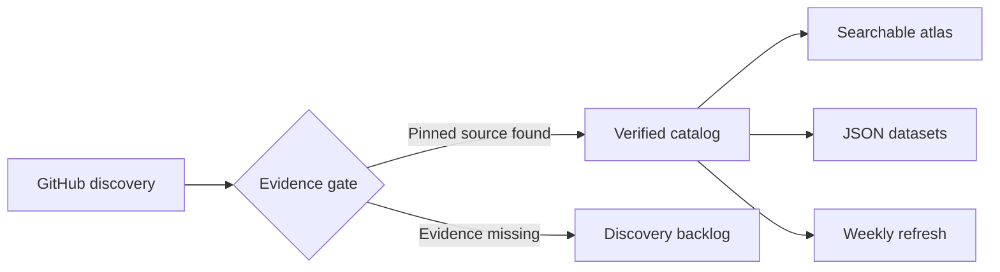

<div align="center">

<a href="https://periodblue.github.io/jev-project-atlas/"></a>

# JEV Project Atlas

### The source-backed map of the JEV / TypeSafe System One ecosystem.

[](CATALOG.md)
[](data/discovered-repos.json)
[](METHODOLOGY.md)

<a href="https://periodblue.github.io/jev-project-atlas/"></a>
<a href="CATALOG.md"></a>

**English** · [简体中文](README.zh-CN.md)

</div>

> [!TIP]
> **Start with the [interactive atlas](https://periodblue.github.io/jev-project-atlas/)** — search 479 verified projects by domain, language, license, or decision point.

## A map, not a hype list

JEV is TypeSafe AI's fast, typed decision model for classification, routing, scoring, ranking, verification, and guardrails. This atlas separates projects backed by inspectable source evidence from repositories that merely carry a topic label.

<table>
<tr>
<td align="center" width="33%"><h2>479</h2><strong>Source-verified</strong><br><sub>Pinned evidence for the JEV decision point</sub></td>
<td align="center" width="33%"><h2>1,169</h2><strong>Topic-discovered</strong><br><sub>The full public GitHub discovery snapshot</sub></td>
<td align="center" width="33%"><h2>17</h2><strong>Real-world domains</strong><br><sub>From browser control to model routing</sub></td>
</tr>
</table>

> [!IMPORTANT]
> **Source-verified does not mean security-audited, benchmark-reproduced, or production-endorsed.** JEV itself is a hosted model; open SDKs, integrations, and compatible implementations are not open model weights.

## How trust flows through the atlas



Every verified entry answers three questions: **What does it do? Where does JEV decide? What public source proves it?** The broader topic snapshot is retained for recall, but never presented as verified.

## Projects worth opening first

| Project | Why it matters | Stars | License |
|---|---|---:|---|
| [langchain-ai/langchain](https://github.com/langchain-ai/langchain) | An optional Jev classifier integration for Python LangChain workflows. | **146,831** | `MIT` |
| [virattt/ai-hedge-fund](https://github.com/virattt/ai-hedge-fund) | An educational AI hedge-fund prototype with an optional Jev adapter for structured judgments in fund decision workflows. | **63,657** | `MIT` |
| [BerriAI/litellm](https://github.com/BerriAI/litellm) | LiteLLM can use Jev to classify requests for its complexity-based model router. | **59,361** | `Unknown` |
| [can1357/oh-my-pi](https://github.com/can1357/oh-my-pi) | Oh My Pi includes an optional TypeSafe judgment provider for bounded decisions in coding-agent workflows. | **32,380** | `MIT` |
| [davila7/claude-code-templates](https://github.com/davila7/claude-code-templates) | A community Claude Code Templates mod that uses Jev to suggest subagent models and reasoning levels. | **30,897** | `MIT` |
| [ComposioHQ/composio](https://github.com/ComposioHQ/composio) | An optional TypeSafe provider for Composio that uses Jev to choose among tools and bounded argument options. | **30,279** | `MIT` |
| [vercel/ai](https://github.com/vercel/ai) | The TypeSafe provider in AI SDK lets TypeScript applications call Jev through the shared evaluate interface. | **26,887** | `Unknown` |
| [trycua/cua](https://github.com/trycua/cua) | Cua’s preview jev-use example pairs Driver observation and execution with bounded Jev browser-action choices. | **25,783** | `MIT` |

## Explore the ecosystem

| Domain | Projects |
|---|---:|
| SDK & Decision Frameworks | **90** |
| Security & Guardrails | **41** |
| High-Frequency & Simulation | **40** |
| Routing & Cost Optimization | **38** |
| Browser & OS Action | **38** |
| Domain & Vertical Tools | **34** |
| MCP & Integrations | **30** |
| Context GC & Filter | **29** |
| Evaluation & Observability | **29** |
| CLI & Pipelines | **29** |
| Data & Search | **28** |
| Creative Tools | **16** |
| Codebase & Graph Pathfinding | **13** |
| Decision Tools | **12** |
| SDK & Integrations | **6** |
| Voice & Conversation | **4** |
| Classification & Taxonomy | **2** |

**Leading languages:** `Unknown` 220 · `TypeScript` 99 · `Python` 70 · `JavaScript` 33 · `Rust` 14 · `Go` 11 · `Ruby` 5 · `Swift` 3

## Use the atlas your way

| I want to… | Go here |
|---|---|
| Search and filter visually | **[Interactive atlas →](https://periodblue.github.io/jev-project-atlas/)** |
| Read every verified entry | **[Full catalog →](CATALOG.md)** |
| Analyze or build on the data | [Verified JSON](data/verified-projects.json) · [Discovery JSON](data/discovered-repos.json) |
| Audit the inclusion rules | [Methodology](METHODOLOGY.md) |
| Submit a missing project | [Contribution guide](CONTRIBUTING.md) |

## Reproducible by default

```bash
python scripts/sync.py
```

The zero-dependency sync script refreshes GitHub discovery, normalizes the source-reviewed dataset, and rebuilds both languages, both catalogs, and the live explorer. GitHub Actions runs it weekly.

## Provenance

The verified layer builds on the MIT-licensed source review in [logicrw/awesome-jev-projects](https://github.com/logicrw/awesome-jev-projects), normalized and presented here as a two-layer atlas. Discovery comes directly from the [GitHub `jev` topic](https://github.com/topics/jev). See [third-party notices](THIRD_PARTY_NOTICES.md).

## License

Atlas code and original content are [MIT licensed](LICENSE). Listed projects keep their own licenses.
