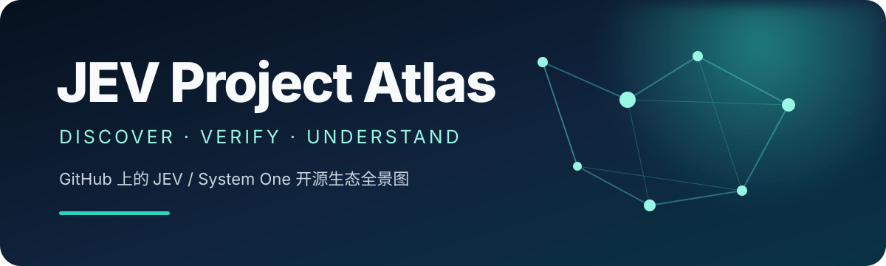
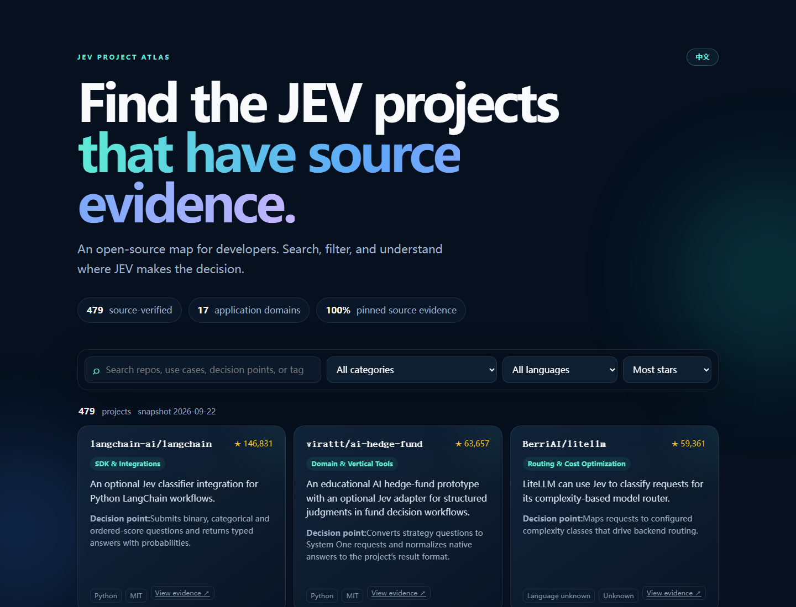

<div align="center">

<a href="https://periodblue.github.io/jev-project-atlas/"></a>

### Know which JEV projects are real.

**479 projects with pinned source evidence — searchable by use case, language, license, and the exact point where JEV makes a decision.**

[](CATALOG.md)
[](data/discovered-repos.json)
[](METHODOLOGY.md)
[](LICENSE)

**[Explore the live atlas →](https://periodblue.github.io/jev-project-atlas/)** &nbsp;·&nbsp; [Browse the catalog](CATALOG.md) &nbsp;·&nbsp; [Use the data](#use-the-data)

**English** · [简体中文](README.zh-CN.md)

</div>

<br>

<a href="https://periodblue.github.io/jev-project-atlas/"></a>

<p align="center"><sub>Search the verified ecosystem in the <a href="https://periodblue.github.io/jev-project-atlas/">interactive explorer</a>.</sub></p>

## The JEV ecosystem, without the noise

GitHub has **1,169 repositories tagged `jev`**. A topic tells you almost nothing: the project may call JEV in production, mention it in a roadmap, imitate its interface, or simply carry a noisy label.

**JEV Project Atlas tells those apart.** It keeps every discoverable lead, but only promotes a project after its public source reveals the actual integration or decision point.

<table>
<tr>
<td align="center" width="33%"><h2>479</h2><b>verified projects</b><br><sub>each linked to immutable source</sub></td>
<td align="center" width="33%"><h2>17</h2><b>application domains</b><br><sub>from agents to databases</sub></td>
<td align="center" width="33%"><h2>1,169</h2><b>repos monitored</b><br><sub>the recall layer stays searchable</sub></td>
</tr>
</table>

## Start exploring

<table>
<tr>
<td width="33%" valign="top"><h3>🧩 Build with JEV</h3><a href="https://github.com/vercel/ai"><strong>vercel/ai</strong></a><br><sub>The TypeSafe provider in AI SDK lets TypeScript applications call Jev through the shared evaluate interface.</sub><br><br><a href="https://github.com/langchain-ai/langchain"><strong>langchain-ai/langchain</strong></a><br><sub>An optional Jev classifier integration for Python LangChain workflows.</sub><br><br><a href="https://github.com/pydantic/pydantic-ai"><strong>pydantic/pydantic-ai</strong></a><br><sub>An optional TypeSafe provider and Jev model integration for Pydantic AI.</sub></td>
<td width="33%" valign="top"><h3>⚡ See it decide</h3><a href="https://github.com/browser-use/jev-ultrafast"><strong>browser-use/jev-ultrafast</strong></a><br><sub>A browser Agent that uses Jev to choose actions and page controls, calling a text model only when input is needed.</sub><br><br><a href="https://github.com/trycua/cua"><strong>trycua/cua</strong></a><br><sub>Cua’s preview jev-use example pairs Driver observation and execution with bounded Jev browser-action choices.</sub><br><br><a href="https://github.com/realZachi/pg-jev"><strong>realZachi/pg-jev</strong></a><br><sub>Adds natural-language filtering, classification, and ranking of rows to PostgreSQL queries.</sub></td>
<td width="33%" valign="top"><h3>🧪 Run the shape locally</h3><a href="https://github.com/jaredpalmer/kev"><strong>jaredpalmer/kev</strong></a><br><sub>Tiny Jev-like decision head built atop Qwen2.5-0.5B that can be trained and run locally on Apple Silicon MacBooks.</sub><br><br><a href="https://github.com/featherless-ai/simple-jev"><strong>featherless-ai/simple-jev</strong></a><br><sub>Adapter turning open LLM endpoints into Jev-compatible classification services without training a separate classifier head.</sub></td>
</tr>
</table>

**[See all 479 verified projects →](CATALOG.md)**

## Why trust this list?

1. **Discover broadly.** The sync scans the whole public `jev` topic, split to avoid GitHub's 1,000-result search cap.
2. **Verify narrowly.** A project enters the catalog only when a reviewer can point to an immutable source file where JEV is called, adapted, or reimplemented.
3. **Explain plainly.** Every entry says what the project does, where JEV decides, and what evidence supports the claim.

> [!NOTE]
> “Verified” means the public source was inspected. It does **not** mean security-audited, benchmark-reproduced, or production-endorsed. JEV itself is hosted; open SDKs and compatible projects are not open JEV weights.

## Use the data

Both layers are committed as clean JSON. For example, list verified Python projects:

```bash
curl -sL https://raw.githubusercontent.com/PeriodBLUE/jev-project-atlas/main/data/verified-projects.json \
  | jq -r '.projects[] | select(.language == "Python") | .repo'
```

- [`verified-projects.json`](data/verified-projects.json) — curated entries, summaries, categories, metadata, and pinned source evidence.
- [`discovered-repos.json`](data/discovered-repos.json) — the complete discovery snapshot, including unverified leads.

## Keep it current

```bash
python scripts/sync.py
```

No package install. The standard-library script refreshes discovery and rebuilds the English and Chinese READMEs, catalogs, datasets, and explorer. GitHub Actions runs it every week.

---

<p align="center"><b>Found something missing?</b> <a href="CONTRIBUTING.md">Submit a project</a> · <a href="METHODOLOGY.md">Read the methodology</a> · <a href="THIRD_PARTY_NOTICES.md">Provenance</a> · <a href="LICENSE">MIT License</a></p>
