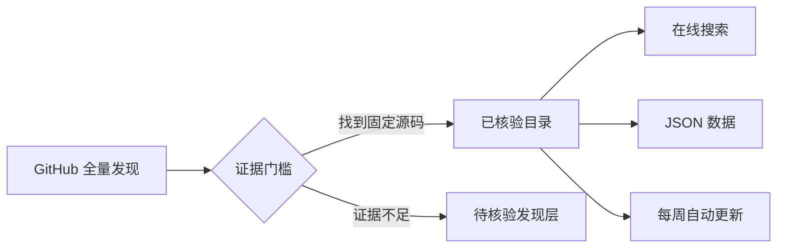

<div align="center">

<a href="https://periodblue.github.io/jev-project-atlas/"></a>

# JEV Project Atlas · JEV 项目全景图

### 有源码证据的 JEV / TypeSafe System One 生态地图。

[](CATALOG.zh-CN.md)
[](data/discovered-repos.json)
[](METHODOLOGY.zh-CN.md)

<a href="https://periodblue.github.io/jev-project-atlas/?lang=zh"></a>
<a href="CATALOG.zh-CN.md"></a>

[English](README.md) · **简体中文**

</div>

> [!TIP]
> 建议从[在线项目全景图](https://periodblue.github.io/jev-project-atlas/?lang=zh)开始：可按领域、语言、许可证或决策点搜索 479 个已核验项目。

## 这是一张地图，不是热度榜

JEV 是 TypeSafe AI 面向分类、路由、评分、排序、验证与安全门控的快速类型化决策模型。本项目将有可检查源码证据的真实集成，与仅贴有 topic 标签的候选仓库严格分开。

<table>
<tr>
<td align="center" width="33%"><h2>479</h2><strong>源码已核验</strong><br><sub>能定位 JEV 决策点的固定提交证据</sub></td>
<td align="center" width="33%"><h2>1,169</h2><strong>Topic 已发现</strong><br><sub>GitHub 公开仓库的完整发现快照</sub></td>
<td align="center" width="33%"><h2>17</h2><strong>真实应用领域</strong><br><sub>从浏览器控制到模型路由</sub></td>
</tr>
</table>

> [!IMPORTANT]
> **源码已核验不代表通过安全审计、性能复现或生产背书。** JEV 本体是托管模型；开源 SDK、集成与兼容实现不等于开放模型权重。

## 可信信息如何进入全景图



每个已核验条目都回答三个问题：**项目做什么？JEV 在哪里决策？哪段公开源码可以证明？** Topic 快照用于查漏，但绝不会被冒充为已核验项目。

## 值得先看的项目

| 项目 | 为什么值得看 | 星标 | 许可证 |
|---|---|---:|---|
| [langchain-ai/langchain](https://github.com/langchain-ai/langchain) | 给 Python LangChain 流程加一个可选 Jev 分类节点，返回类别、概率和等级评分。 | **146,831** | `MIT` |
| [virattt/ai-hedge-fund](https://github.com/virattt/ai-hedge-fund) | 一个教育用途的 AI 对冲基金原型，其中可选 Jev 适配器把结构化判断接到基金决策流程。 | **63,657** | `MIT` |
| [BerriAI/litellm](https://github.com/BerriAI/litellm) | LiteLLM 的复杂度路由器可选用 Jev 判断请求应交给哪个模型档位。 | **59,361** | `Unknown` |
| [can1357/oh-my-pi](https://github.com/can1357/oh-my-pi) | Oh My Pi 编程 Agent 内含可选的 TypeSafe 判断提供器，供小型决策流程调用。 | **32,380** | `MIT` |
| [davila7/claude-code-templates](https://github.com/davila7/claude-code-templates) | claude-code-templates 社区仓库中的 Jev 路由模组，为 Claude Code 子 Agent 建议模型与思考档位。 | **30,897** | `MIT` |
| [ComposioHQ/composio](https://github.com/ComposioHQ/composio) | Composio 的可选 TypeSafe provider，用 Jev 从工具与有限参数选项中做判断。 | **30,279** | `MIT` |
| [vercel/ai](https://github.com/vercel/ai) | AI SDK 中的 TypeSafe provider，让 TypeScript 应用通过统一 evaluate 接口调用 Jev。 | **26,887** | `Unknown` |
| [trycua/cua](https://github.com/trycua/cua) | Cua 仓库的 jev-use 预览示例：Driver 观察与执行，Jev 从有界候选中选择浏览器动作。 | **25,783** | `MIT` |

## 探索生态

| 应用领域 | 项目数 |
|---|---:|
| SDK & Decision Frameworks | **90** |
| Security & Guardrails | **41** |
| High-Frequency & Simulation | **40** |
| Routing & Cost Optimization | **38** |
| Browser & OS Action | **38** |
| Domain & Vertical Tools | **34** |
| MCP & Integrations | **30** |
| Context GC & Filter | **29** |
| Evaluation & Observability | **29** |
| CLI & Pipelines | **29** |
| Data & Search | **28** |
| Creative Tools | **16** |
| Codebase & Graph Pathfinding | **13** |
| Decision Tools | **12** |
| SDK & Integrations | **6** |
| Voice & Conversation | **4** |
| Classification & Taxonomy | **2** |

**主要语言：** `Unknown` 220 · `TypeScript` 99 · `Python` 70 · `JavaScript` 33 · `Rust` 14 · `Go` 11 · `Ruby` 5 · `Swift` 3

## 按你的方式使用

| 我想…… | 去这里 |
|---|---|
| 可视化搜索和筛选 | **[在线项目全景图 →](https://periodblue.github.io/jev-project-atlas/?lang=zh)** |
| 阅读全部核验条目 | **[中文完整目录 →](CATALOG.zh-CN.md)** |
| 分析或二次开发 | [已核验 JSON](data/verified-projects.json) · [发现层 JSON](data/discovered-repos.json) |
| 检查收录标准 | [方法与边界](METHODOLOGY.zh-CN.md) |
| 提交遗漏项目 | [贡献指南](CONTRIBUTING.zh-CN.md) |

## 默认可复现

```bash
python scripts/sync.py
```

零依赖同步脚本会刷新 GitHub 发现层、规范化源码核验数据，并重建中英文 README、中英文目录和在线搜索页。GitHub Actions 每周自动运行。

## 数据来源

核验层基于 [logicrw/awesome-jev-projects](https://github.com/logicrw/awesome-jev-projects) 的 MIT 许可源码审查数据，并在本仓库中重新规范化、分层与呈现；发现层直接来自 [GitHub `jev` topic](https://github.com/topics/jev)。详见[第三方声明](THIRD_PARTY_NOTICES.md)。

## 许可证

本仓库代码与原创内容采用 [MIT License](LICENSE)，各被收录项目仍遵循其自身许可证。
